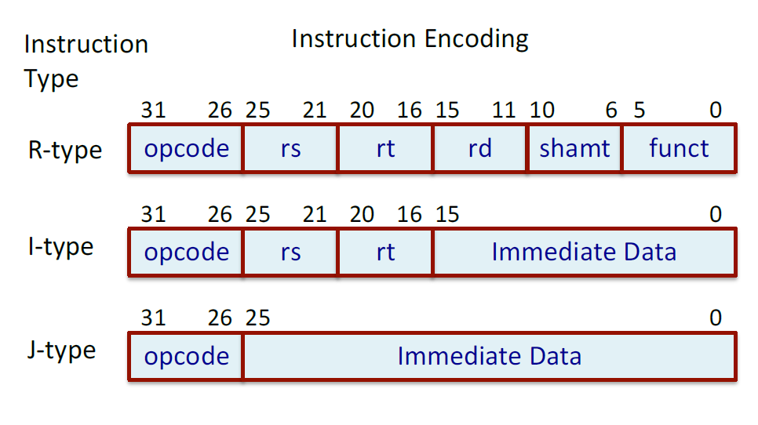

# 🚀 5-Stage Pipelined MIPS32 Processor

This project presents a complete **behavioral Verilog model** of a MIPS32 processor implemented with a **5-stage instruction pipeline**. The design covers a subset of the MIPS32 instruction set, supports memory operations, arithmetic/logic operations, branching, and halting.  

The pipeline implementation follows the classic **IF–ID–EX–MEM–WB** structure, providing a foundation to understand RISC processor design and hazard handling.  

---

## 📖 Overview  
- **Architecture**: MIPS32 RISC  
- **Pipeline Depth**: 5 stages  
- **Registers**: 32 general purpose (R0–R31, with R0 fixed at 0)  
- **Program Counter (PC)**: 32-bit  
- **Memory**: word-addressable, 32-bit word size  
- **Implementation Style**: Behavioral Verilog with two-phase clocking  
- **Special signals**:  
  - `HALTED`: Raised after `HLT` instruction completes  
  - `TAKEN_BRANCH`: Controls flushing of wrong-path instructions  

---

## 🧾 Instruction Set  

Supported subset of MIPS32 instructions:  

**1. Load/Store**  
```asm
LW   R2,124(R8)    // R2 ← Mem[R8+124]  
SW   R5,-10(R25)   // Mem[R25-10] ← R5  
```  

**2. Arithmetic/Logic (Register)**  
```asm
ADD  R1,R2,R3      // R1 ← R2 + R3  
SUB  R12,R10,R8    // R12 ← R10 – R8  
AND  R20,R1,R5     // R20 ← R1 & R5  
OR   R11,R5,R6     // R11 ← R5 | R6  
MUL  R5,R6,R7      // R5 ← R6 × R7  
SLT  R5,R11,R12    // R5 ← (R11 < R12) ? 1 : 0  
```  

**3. Arithmetic/Logic (Immediate)**  
```asm
ADDI R1,R2,25      // R1 ← R2 + 25  
SUBI R5,R1,150     // R5 ← R1 – 150  
SLTI R2,R10,10     // R2 ← (R10 < 10) ? 1 : 0  
```  

**4. Branch/Jump/Misc**  
```asm
BEQZ  R1,Loop      // Branch if R1 == 0  
BNEQZ R5,Label     // Branch if R5 ≠ 0  
J     Target       // Unconditional jump  
HLT                 // Halt execution  
```  

---

## 🔢 Instruction Encoding  

MIPS32 instructions are categorized into three formats:  

- **R-type:** Register operations (e.g., ADD, SUB, MUL)  
- **I-type:** Immediate operations, Load/Store, Branches  
- **J-type:** Unconditional jumps  



- shamt (shift amount): Used to specify the number of bit positions to shift.
- funct (function field): Extends the opcode to define additional operations.
- Some instructions require two register operands (rs and rt), while others need only one operand (rs).
- This distinction becomes clear only after the instruction is decoded.
- During decoding, the processor can prefetch register values in parallel — these may or may not be used depending on the instruction.
- Likewise, 16-bit and 26-bit immediate values are fetched and sign-extended to 32 bits in advance, so they are available if required later.

---

## 🛠 Pipeline Stages  

Each instruction flows through five stages:  

1. **IF (Instruction Fetch):** Fetch instruction from memory  
2. **ID (Instruction Decode):** Decode opcode, fetch registers/immediates  
3. **EX (Execute):** ALU operation or effective address calculation  
4. **MEM (Memory Access):** Load/Store operations and branch resolution  
5. **WB (Write Back):** Write result into register file  

---

## 🔄 Datapath Design  

- **Pipelined datapath**
  

---

## 📂 Verilog Source Files  

- `mips32_pipelined_design.v` → Processor design  
- `testbench.v` → Testbench for program simulation  
- `mips32_pipelined_design.vvp` → Compiled simulation file  
- `mips.vcd` → Waveform dump (for GTKWave or other viewers)  

🔗 **Run Online (EDA Playground):** [Click Here](https://edaplayground.com/x/vVz7)

---

## ▶ Running the Simulation  

1. Compile design and testbench:  
   ```bash
   iverilog -o mips32_pipelined_design.vvp mips32_pipelined_design.v testbench.v
   ```  

2. Run simulation:  
   ```bash
   vvp mips32_pipelined_design.vvp
   ```  

3. Open waveform output:  
   ```bash
   gtkwave mips.vcd
   ```  

---

## 📘 Sample Programs  

### Example : Add 10 + 20 + 25  
```asm
ADDI R1,R0,10  
ADDI R2,R0,20  
ADDI R3,R0,25  
ADD  R4,R1,R2  
ADD  R5,R4,R3  
HLT
```

## Instructions

| Assembly Instruction | Machine Code                                | Hexcode   |
|-----------------------|---------------------------------------------|-----------|
| ADDI R1,R0,10         | 001010 00000 00001 0000000000001010         | 2801000a  |
| ADDI R2,R0,20         | 001010 00000 00010 0000000000010100         | 28020014  |
| ADDI R3,R0,25         | 001010 00000 00011 0000000000011001         | 28030019  |
| OR R7,R7,R7 (dummy)   | 001010 00000 00011 0000000000011001         | 0ce77800  |
| OR R7,R7,R7 (dummy)   | 001010 00000 00011 0000000000011001         | 0ce77800  |
| ADD R4,R1,R2          | 000000 00001 00010 00100 00000 000000       | 00222000  |
| OR R7,R7,R7 (dummy)   | 001010 00000 00011 0000000000011001         | 0ce77800  |
| ADD R5,R4,R3          | 000000 00100 00011 00101 00000 000000       | 00832800  |
| HLT                   | 111111 00000 00000 00000 00000 000000       | fc000000  |


**Expected Output:**  
```
R1 = 10, R2 = 20, R3 = 25, R4 = 30, R5 = 55
```  

---

## 📊 Results  

- **Console Output (Sample Run):**  
```
R0 -  0
R1 - 10
R2 - 20
R3 - 25
R4 - 30
R5 - 55
```  

- **Waveform (GTKWave):**  
    

---

## ⚠ Known Limitations  

- Structural hazards due to shared resources  
- Data hazards in dependent instruction sequences  
- Control hazards in branch handling  
- No hazard mitigation logic → dummy instructions must be inserted in programs  

